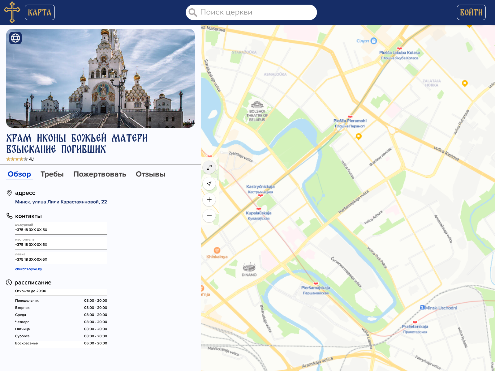
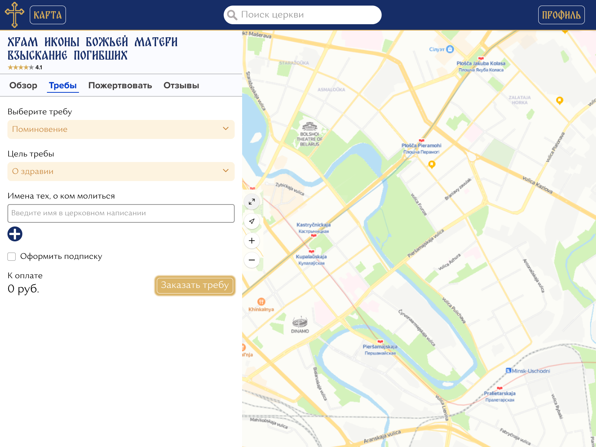
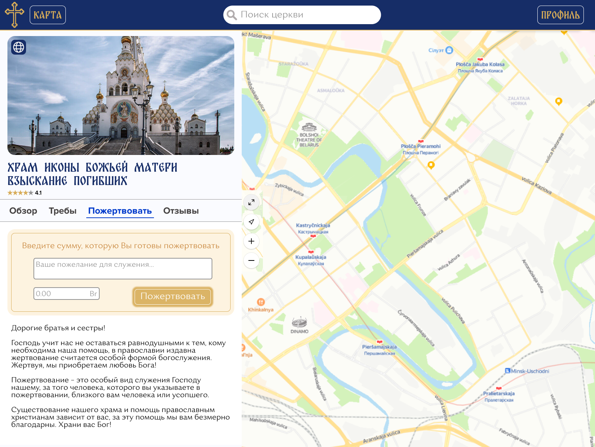
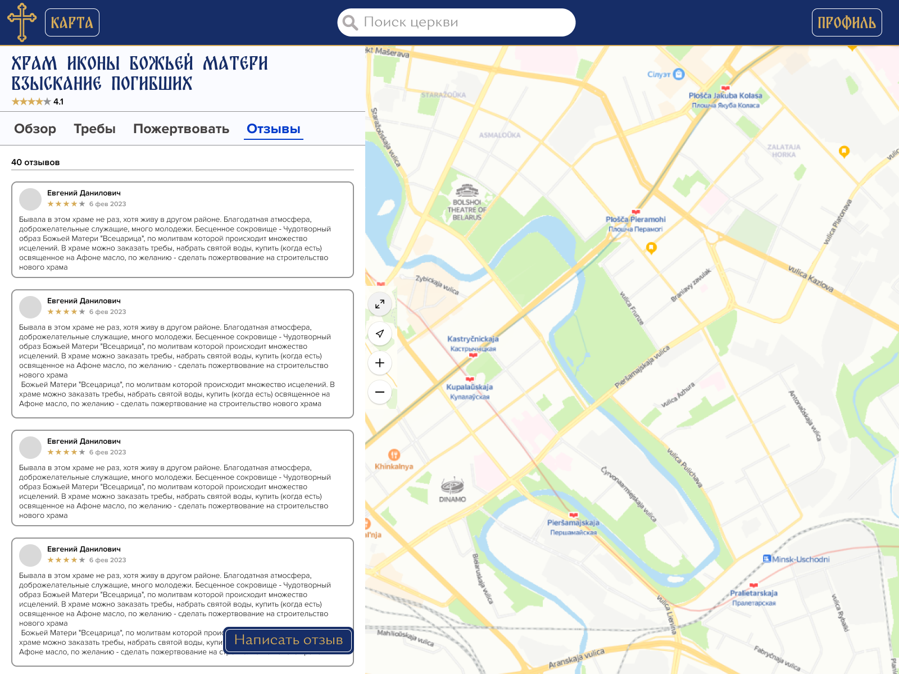
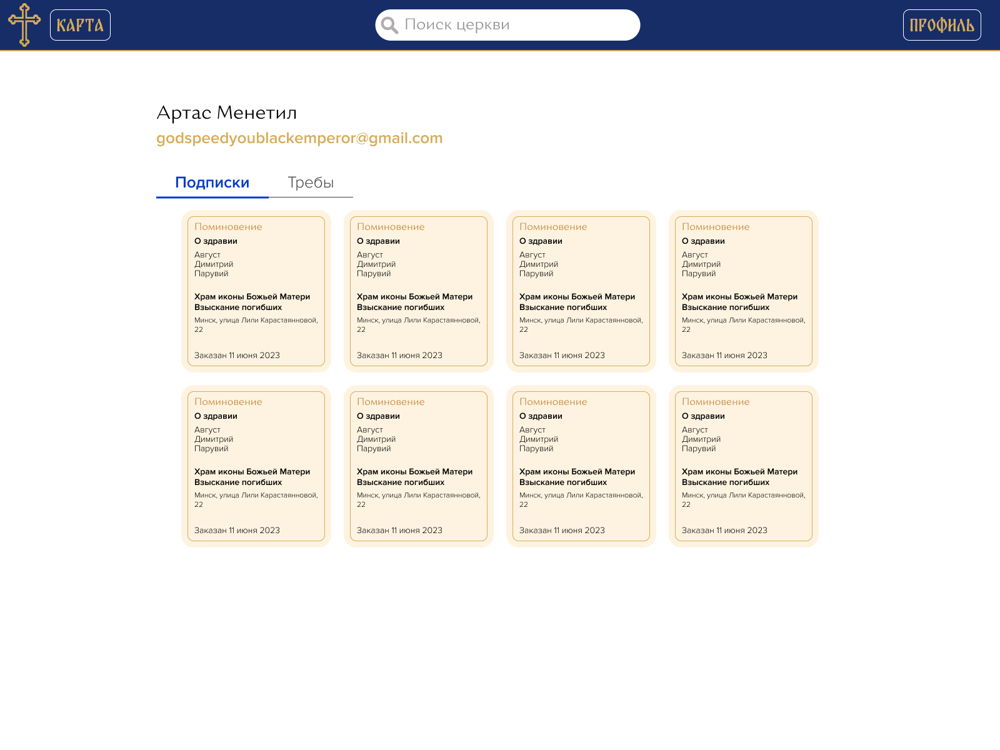
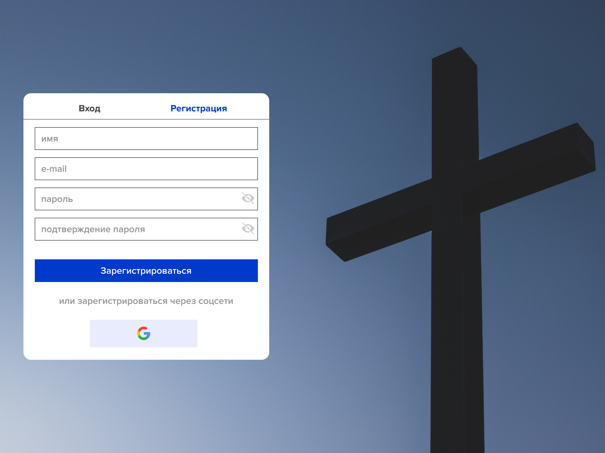

# ITDDP

# ТЕМА: Церковный православный портал

## Описание

Приложение с каталогом храмов и церквей, а так же церковными онлайн услугами: карта ближайших храмов и церквей, провославный календарь, поле для ввода суммы пожертвования, электронная запись на таинства крещения и венчания, а так же отпевание, заказать молебен или оформить подписку на молебны. 

## Deploy Link

https://dburackov.github.io/IT-DDP/

## Функционал

- Авторизация
- Карта церквей
- Поиск церквей по названию
- Пожертвования 
- Заказ треб 
- подписка на требы
- оценки о отзывы
- личный кабинет:
    - список активных подписок 
    - актуальные требы 
    - история заказов

## Макет

## Схема данных

1. User
    + id
    + login
    + email

2. Church
    + id
    + name
    
3. Adress
    + id
    + church_id
    + city
    + street
    + unit

4. Contact
    + id
    + church_id
    + name
    + contact 

5. Schedule    
    + id
    + church_id
    + schedule

6. Review
    + id
    + user_id
    + church_id
    + content
    + date

7. Mark
    + id
    + review_id
    + value

8. treba
    + id
    + user_id
    + kind
    + purpose
